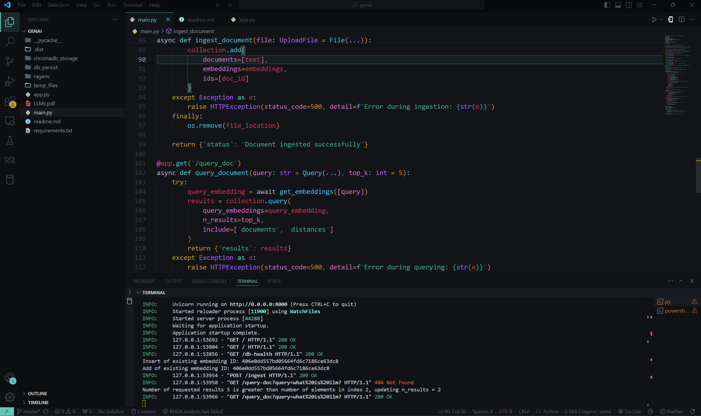
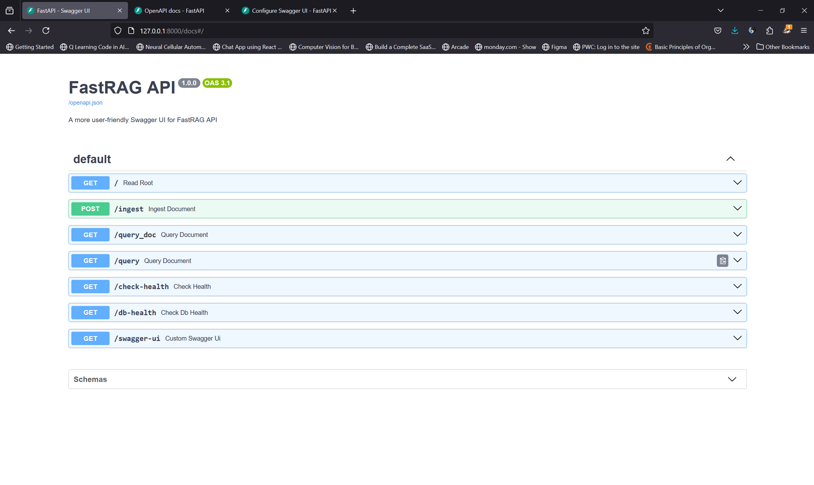

# **FastRAG: A (Retrieval-Augmented Generation) RAG Bot using FastAPI and ChromaDB**

FastRAG is an advanced chatbot powered by Retrieval-Augmented Generation (RAG) using FastAPI and ChromaDB, which allows users to query documents (PDF, DOCX, TXT) and receive AI-generated, contextually relevant answers. By combining the power of pre-trained models from Hugging Face with vector-based retrieval and natural language generation, FastRAG enables intelligent and highly responsive interactions with stored documents.


---

## **Table of Contents**

-   [Project Overview](#project-overview)
-   [Scope](#scope)
-   [Features](#features)
-   [Techniques Used](#techniques-used)
-   [Libraries Used](#libraries-used)
-   [Setup & Installation](#setup--installation)
-   [Usage](#usage)
-   [API Endpoints](#api-endpoints)
-   [Future Scope](#future-scope)
-   [Postman Server Testing](#postman-server-testing)
-   [License](#license)
-   [Conclusion](#conclusion)

---

## **Project Overview**

FastRAG is a Retrieval-Augmented Generation chatbot that answers user queries based on relevant documents. The project leverages **ChromaDB** for document ingestion, **Hugging Face** for embedding generation, and **FastAPI** for building high-performance APIs.

FastRAG’s unique feature is its combination of traditional document search and AI-based response generation, providing a richer and more accurate response to user queries. The project also includes a customizable **Swagger UI** for easy exploration of the API.



---

## **Scope**

FastRAG aims to provide an intuitive and intelligent bot that can:

-   Retrieve relevant documents from a document collection.
-   Generate answers based on those documents.
-   Handle a wide variety of document types, including **PDF**, **DOCX**, and **TXT** files.
-   Allow users to interact with the bot through a fast and responsive web interface.

This project has been designed with ease of integration, scalability, and efficiency in mind, making it suitable for enterprise-level applications that require efficient document processing and AI-driven insights.

---

## **Features**

-   **Document Querying**: Allows users to input queries related to uploaded documents.
-   **Retrieval-Augmented Generation (RAG)**: Combines document retrieval with language generation for more accurate answers.
-   **AI-Powered Responses**: Uses pre-trained models to generate contextually relevant answers.
-   **ChromaDB Integration**: A persistent vector database for efficient document storage and retrieval.
-   **FastAPI Backend**: A lightweight backend for serving the model and processing user queries.
-   **Custom Swagger UI**: A sleek and customizable Swagger UI to easily interact with the API endpoints.
-   **Real-Time Interactions**: Fast and responsive chat interface for real-time query answering.

---

## **Techniques Used**

### **Retrieval-Augmented Generation (RAG)**

RAG combines retrieval and generation to enhance the quality of answers. Instead of relying solely on a pre-trained model, RAG first retrieves documents relevant to the user's query, then generates an answer using those documents. This enables more accurate, context-aware responses.

### **ChromaDB for Document Storage**

ChromaDB is a vector database used to store document embeddings. The embeddings are generated from the documents and serve as a searchable index. ChromaDB enables fast and efficient similarity search, helping retrieve relevant documents based on user queries.

### **Hugging Face Transformers**

We use Hugging Face's `sentence-transformers/all-MiniLM-L6-v2` to generate sentence embeddings. This helps in creating vector representations of document contents, which can be compared for similarity.

### **FastAPI**

FastAPI is used for creating the backend API. It provides a high-performance, easy-to-use framework for serving machine learning models and processing requests asynchronously.

---

## **Libraries Used**

### **FastAPI**

-   **Reason**: FastAPI is chosen for its high performance, simplicity, and ease of use. It allows for the quick creation of APIs and is ideal for serving machine learning models.

### **ChromaDB**

-   **Reason**: ChromaDB is an efficient vector database that handles document embeddings and retrieval tasks. It is perfect for managing document-based data and performing high-speed retrieval queries.

### **Hugging Face Transformers**

-   **Reason**: Hugging Face's transformers library is used to generate embeddings for the text in the documents. The `sentence-transformers/all-MiniLM-L6-v2` model offers an excellent balance of speed and accuracy, making it ideal for our use case.

### **Requests**

-   **Reason**: The `requests` library is used to handle HTTP requests between the FastAPI backend and the chatbot interface, allowing seamless communication.

### **Streamlit**

-   **Reason**: Streamlit is used for the frontend interface of the chatbot, providing a simple way to interact with the backend and view chat history. It offers fast deployment and a clean, user-friendly interface.

---

## **Setup & Installation**

1. Clone the repository:
    ```bash
    git clone https://github.com/yourusername/FastRAG.git
    cd FastRAG
    ```
2. Install the required dependencies:
    ```bash
    pip install -r requirements.txt
    ```
3. Run the FastAPI backend server:
    ```bash
    uvicorn app:app --reload
    ```
    Or by
    ```bash
    python main.py
    ```
4. Access the Swagger UI at:
    ```
    localhost:8000/docs
    ```
5. Start the user interface streamlit app:
    ```bash
    streamlit run app.py
    ```

## **Usage**

Once the application is running, open the **Streamlit interface** in your browser. The user will be able to:

-   **Input a question**: Type your question in the text box, and click the "Submit" button to send the query.
-   **Receive an answer**: The bot will respond with an AI-generated answer based on the documents you have uploaded and indexed in the backend.
-   **Interact with the bot**: You can continue asking more questions and receive responses in real-time.

The chat interface is designed to be intuitive and user-friendly, providing real-time interaction with the bot.

Additionally, the application includes a **Swagger UI** that you can access at `http://127.0.0.1:8000/docs`. This UI allows you to interact directly with the API endpoints, making it easy to test and explore the API’s functionality, such as querying the bot, viewing responses, and understanding the underlying data structures.

### **How to Use the Chat Interface**

1. **Submit a Query**:
    - Type your question in the input box labeled "You:".
    - Click "Submit" or press `Enter` to send the query to the backend.

2. **Bot Response**:

    - Once the query is processed, the bot will respond with an answer. This response will be displayed in a separate message box marked as "FastRAG Bot".
    - The response will include the confidence score (if available), indicating the certainty of the answer provided.

3. **View Chat History**:

    - All previous interactions will be displayed in a chronological order in the chat window, allowing you to follow along with the conversation and refer back to prior exchanges.
    - The chat interface will automatically scroll to the latest message as the conversation progresses.

4. **Interacting with the Swagger API**:
    - The Swagger UI is accessible via `http://127.0.0.1:8000/docs` when the backend server is running.
    - You can use the Swagger UI to interact with the bot directly by sending queries to the `/query` endpoint, which will return AI-generated responses in a structured format.
    - The Swagger UI allows you to explore other available API endpoints, view request and response formats, and test the functionality of your backend API without needing a frontend interface.

---

### **API Endpoints**

If you prefer to query the API directly without the Streamlit interface, you can use the Swagger UI or send HTTP requests using tools like **Postman** or **curl**.

#### Example Query:


You can use the following example to send a query using **curl**:

```bash
  curl -X 'GET' \
  'http://127.0.0.1:8000/query?query=What+is+artificial+intelligence?' \
  -H 'accept: application/json'
```

### **Swagger UI Documentation**



FastRAG also generates an interactive **Swagger UI** at the `/docs` endpoint, where you can:

-   **Test the API**: Send queries to the bot using the `/query` endpoint.
-   **Understand API Structure**: View the expected request and response formats for each API endpoint.
-   **Validate Inputs**: Make sure that queries are properly formatted and explore API responses in detail.

Access it via: `localhost:8000/doocs`

---

### **Future Scope**

**FastRAG** has several opportunities for growth:

1. **Multi-Language Support**: Enable interactions in various languages.
2. **Real-Time Document Updates**: Keep the knowledge base current with dynamic content.
3. **Contextual Conversations**: Maintain context for personalized, coherent responses.
4. **External Data Integration**: Integrate with external APIs for richer answers.
5. **UI Enhancements**: Add voice interaction, rich media, and personalized chat options.
6. **Sentiment Analysis**: Adapt responses based on user emotions.
7. **Scalability**: Move to cloud platforms for improved performance.
8. **Security**: Implement authentication and encryption for data privacy.
9. **Industry Integrations**: Integrate with domain-specific tools for targeted responses.
10. **User Feedback**: Collect and use ratings to improve response accuracy.

---

### Postman Server Testing


### **License**

This project is licensed under the MIT License. See the LICENSE file for details.

### **Conclusion**

FastRAG is a powerful, user-friendly system that combines retrieval-based document querying with augmented generation capabilities. The FastRAG Bot offers intelligent and context-aware responses, making it an effective tool for various use cases such as customer support, research assistance, or knowledge discovery.

Whether you are using the Swagger UI for API testing or the Streamlit interface for real-time conversation, FastRAG provides a seamless and engaging experience. With its flexible architecture, you can extend or integrate FastRAG into your own projects to suit your specific needs.

##### And with the future enhancements will make **FastRAG** more advanced, scalable, and user-friendly.
